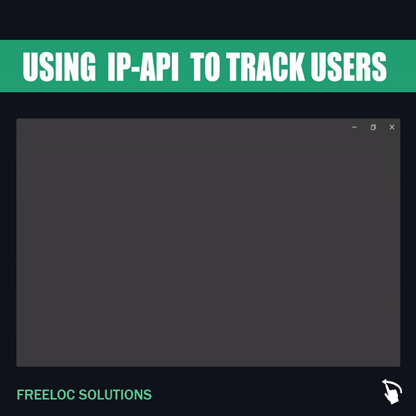

# Using a Geolocator API to fetch a User's Location

Fetch User Location and IP Address with one click.<br/>
An Application made using IP-API services and a PHP server.<br/>
```To run this application on the web, serve the``` [get-api](get-api.php) ```file.```<br/><br/>



